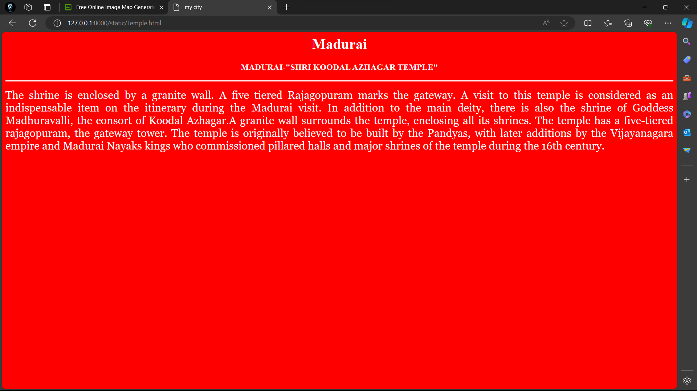
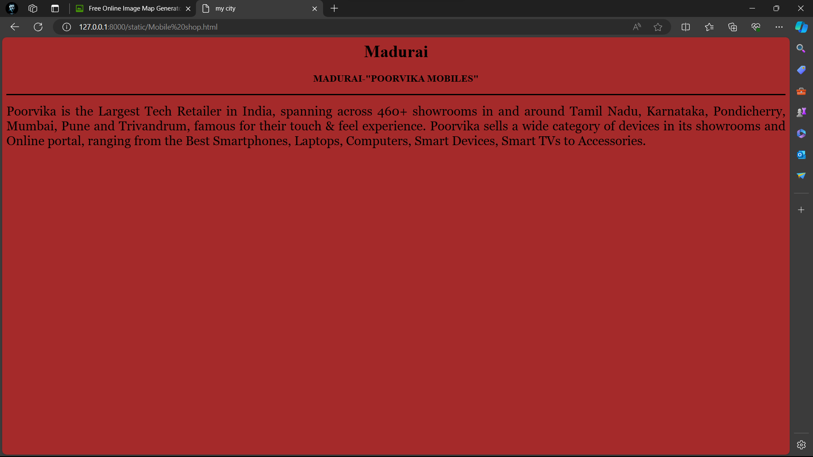
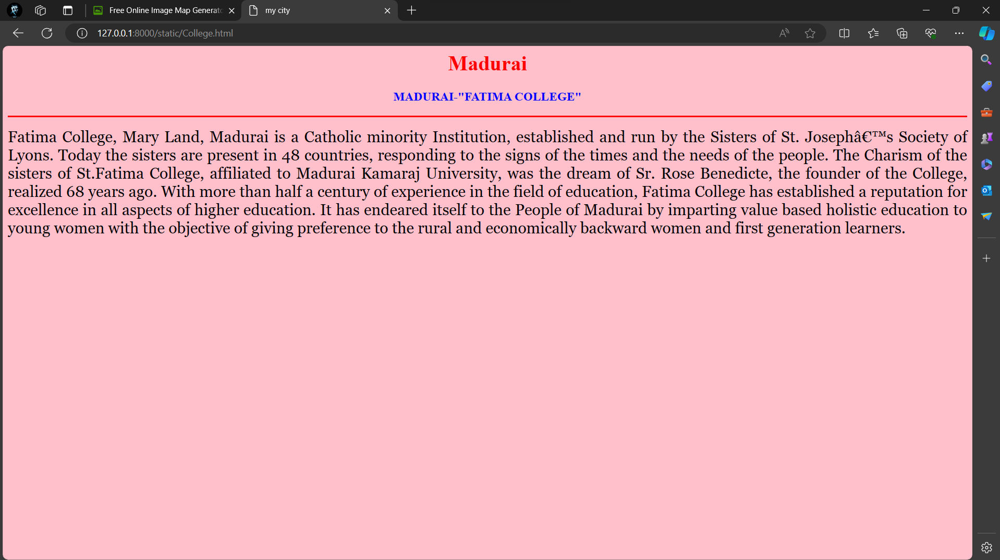
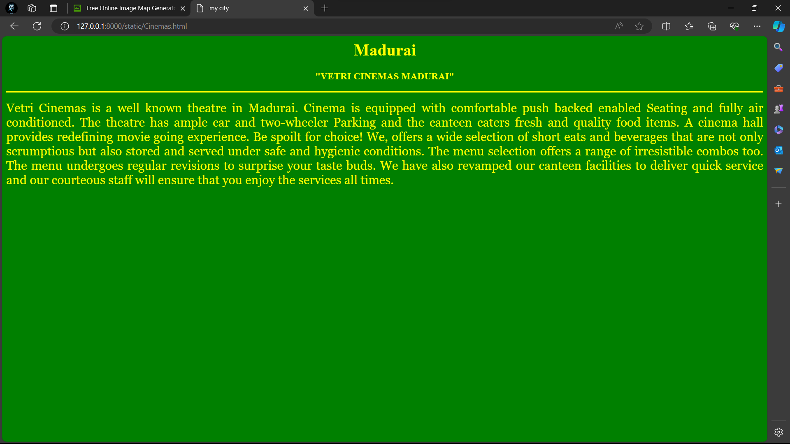
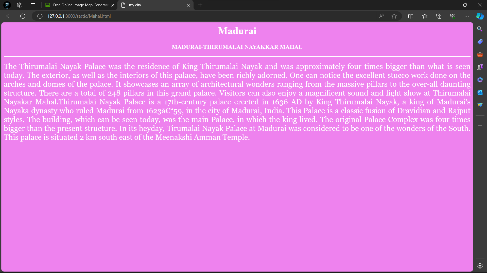

# Ex04 Places Around Me
## Date:28/03/24

## AIM
To develop a website to display details about the places around my house.

## DESIGN STEPS

### STEP 1
Create a Django admin interface.

### STEP 2
Download your city map from Google.

### STEP 3
Using ```<map>``` tag name the map.

### STEP 4
Create clickable regions in the image using ```<area>``` tag.

### STEP 5
Write HTML programs for all the regions identified.

### STEP 6
Execute the programs and publish them.

## CODE

```
Temple.html

<html>
<head>
<title>my city</title>
</head>
<body bgcolor="red">
<h1 align="center" >
<font color="white"><b>Madurai</b></font>   
</h1>
<h3 align="center" >
<font color="white"><b>MADURAI-"SHRI KOODAL AZHAGAR TEMPLE"</b></font>     
</h3>
<hr size="3" color="white">
<p align="justify">
<font face="Georgia" size="5" color="white">
The shrine is enclosed by a granite wall. A five tiered Rajagopuram marks the gateway. A visit to this temple is considered as an indispensable item on the itinerary during the Madurai visit. In addition to the main deity, there is also the shrine of Goddess Madhuravalli, the consort of Koodal Azhagar.A granite wall surrounds the temple, enclosing all its shrines. The temple has a five-tiered rajagopuram, the gateway tower. The temple is originally believed to be built by the Pandyas, with later additions by the Vijayanagara empire and Madurai Nayaks kings who commissioned pillared halls and major shrines of the temple during the 16th century.</font>
</p>
</body>
</html>

```
```
Mobile shop.html

<html>
<head>
<title>my city</title>
</head>
<body bgcolor="brown">
<h1 align="center" >
<font color="black"><b>Madurai</b></font>   
</h1>
<h3 align="center" >
<font color="black"><b>MADURAI-"POORVIKA MOBILES"</b></font>     
</h3>
<hr size="3" color="black">
<p align="justify">
<font face="Georgia" size="5" color="black">
Poorvika is the Largest Tech Retailer in India, spanning across 460+ showrooms in and around Tamil Nadu, Karnataka, Pondicherry, Mumbai, Pune and Trivandrum, famous for their touch & feel experience. Poorvika sells a wide category of devices in its showrooms and Online portal, ranging from the Best Smartphones, Laptops, Computers, Smart Devices, Smart TVs to Accessories. 
</font>
</p>
</body>
</html>

```
```
college.html

<html>
<head>
<title>my city</title>
</head>
<body bgcolor="pink">
<h1 align="center" >
<font color="red"><b>Madurai</b></font>   
</h1>
<h3 align="center" >
<font color="blue"><b>MADURAI-"FATIMA COLLEGE"</b></font>     
</h3>
<hr size="3" color="red">
<p align="justify">
<font face="Georgia" size="5">
Fatima College, Mary Land, Madurai is a Catholic minority Institution, established and run by the Sisters of St. Joseph’s Society of Lyons. Today the sisters are present in 48 countries, responding to the signs of the times and the needs of the people. The Charism of the sisters of St.Fatima College, affiliated to Madurai Kamaraj University, was the dream of Sr. Rose Benedicte, the founder of the College, realized 68 years ago. With more than half a century of experience in the field of education, Fatima College has established a reputation for excellence in all aspects of higher education. It has endeared itself to the People of Madurai by imparting value based holistic education to young women with the objective of giving preference to the rural  and economically backward women and first generation learners.
</font>
</p>
</body>
</html>

```
```
cinemas.html

<html>
<head>
<title>my city</title>
</head>
<body bgcolor="green">
<h1 align="center" >
<font color="yellow"><b>Madurai</b></font>   
</h1>
<h3 align="center" >
<font color="yellow"><b>"VETRI CINEMAS MADURAI"</b></font>     
</h3>
<hr size="3" color="yellow">
<p align="justify">
<font face="Georgia" size="5" color="yellow">
    Vetri Cinemas is a well known theatre in Madurai. Cinema is equipped with comfortable push backed enabled Seating and fully air conditioned. The theatre has ample car and two-wheeler Parking and the canteen caters fresh and quality food items. A cinema hall provides redefining movie going experience. Be spoilt for choice! We, offers a wide selection of short eats and beverages that are not only scrumptious but also stored and served under safe and hygienic conditions. The menu selection offers a range of irresistible combos too. The menu undergoes regular revisions to surprise your taste buds. We have also revamped our canteen facilities to deliver quick service and our courteous staff will ensure that you enjoy the services all times.</p>
</body>
</html>


```
```
Mahal.html

<html>
<head>
<title>my city</title>
</head>
<body bgcolor="violet">
<h1 align="center" >
<font color="white"><b>Madurai</b></font>   
</h1>
<h3 align="center" >
<font color="white"><b>MADURAI-THIRUMALAI NAYAKKAR MAHAL</b></font>     
</h3>
<hr size="3" color="white">
<p align="justify">
<font face="Georgia" size="5" color="white">
The Thirumalai Nayak Palace was the residence of King Thirumalai Nayak and was approximately four times bigger than what is seen today. The exterior, as well as the interiors of this palace, have been richly adorned. One can notice the excellent stucco work done on the arches and domes of the palace. It showcases an array of architectural wonders ranging from the massive pillars to the over-all daunting structure. There are a total of 248 pillars in this grand palace. Visitors can also enjoy a magnificent sound and light show at Thirumalai Nayakar Mahal.Thirumalai Nayak Palace is a 17th-century palace erected in 1636 AD by King Thirumalai Nayak, a king of Madurai's Nayaka dynasty who ruled Madurai from 1623–59, in the city of Madurai, India. This Palace is a classic fusion of Dravidian and Rajput styles. The building, which can be seen today, was the main Palace, in which the king lived. The original Palace Complex was four times bigger than the present structure. In its heyday, Tirumalai Nayak Palace at Madurai was considered to be one of the wonders of the South. This palace is situated 2 km south east of the Meenakshi Amman Temple.</font>
</p>
</body>
</html>

```


## OUTPUT







## RESULT
The program for implementing image maps using HTML is executed successfully.
